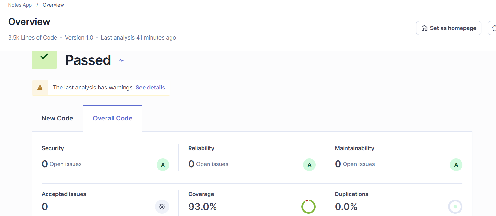
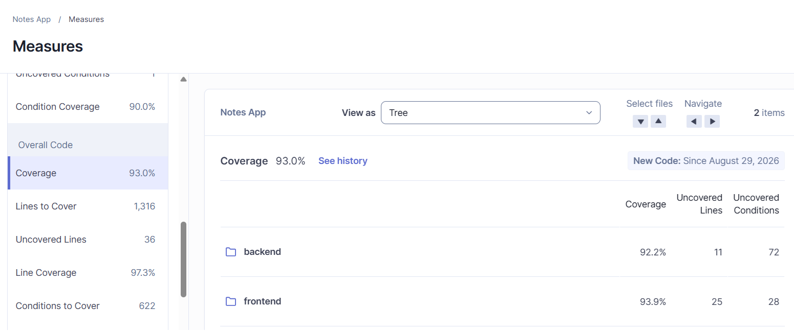
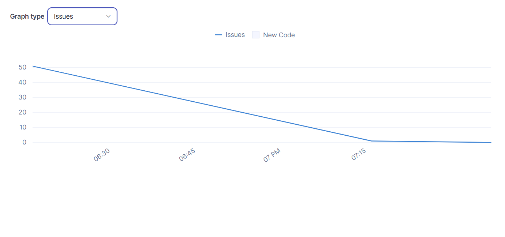

# Notes

A notes app I built for the 10pShine Cohort 9 MERN assignment. You sign up, you
write notes, nobody else can read them.

Muhammad Mahad Bhatti

---

## What it does

Accounts with signup, login and logout. Notes belong to whoever wrote them, and
asking for someone else's note gets you a 404.

The editor does bold, italic, headings, bullet and numbered lists, and links.
From the dashboard you can rename a note, duplicate it, delete it, or export it
as Markdown or plain text.

If you try to leave the editor with unsaved edits it asks first. Closing the
tab asks too.

## Stack

| | |
|---|---|
| Backend | Node.js, Express 5, TypeScript, MongoDB with Mongoose, Zod |
| Frontend | React 19, TypeScript, Vite, React Router, TipTap |
| Auth | JWT in an httpOnly cookie, bcrypt |
| Logging | Pino, plus pino-http for requests |
| Backend tests | Mocha, Chai, Sinon, Supertest |
| Frontend tests | Jest, React Testing Library |
| Analysis | SonarQube, ESLint, Prettier |

---

## Running it

You need Node 24 or newer, and MongoDB running locally on port 27017. Without
Mongo the server refuses to start and the tests fail, so start that first.

Install both halves:

```bash
npm --prefix backend install
npm --prefix frontend install
```

Copy the example env files:

```bash
cp backend/.env.example backend/.env
cp frontend/.env.example frontend/.env
```

Now open `backend/.env` and change `JWT_SECRET`. The app checks for the
placeholder value at startup and refuses to boot while it is still there. That
is deliberate: if the signing key ships with the repo, anyone can forge a
session. Generate a real one with:

```bash
node -e "console.log(require('crypto').randomBytes(48).toString('base64url'))"
```

Then two terminals:

```bash
npm --prefix backend run dev
```

```bash
npm --prefix frontend run dev
```

The app runs at http://localhost:5173 and the API at http://localhost:3000.

### Environment variables

Everything in `backend/.env` is validated by Zod when the process starts, so a
typo fails immediately with a readable message instead of surfacing halfway
through some request later.

| Variable | Default | Notes |
|---|---|---|
| `NODE_ENV` | `development` | |
| `PORT` | `3000` | |
| `LOG_LEVEL` | `info` | `fatal` through `trace`, or `silent` |
| `MONGO_URI` | none | required, has to start with `mongodb://` |
| `JWT_SECRET` | none | required, 32 characters minimum, not the placeholder |
| `JWT_EXPIRES_IN` | `7d` | a duration like `30m` or `7d` |
| `BCRYPT_ROUNDS` | `12` | 4 to 15. The tests drop it to 4 so they finish this year |
| `CORS_ORIGIN` | `http://localhost:5173` | a bare origin, no path or query |

`frontend/.env` has one entry, `VITE_API_URL`, defaulting to
`http://localhost:3000`. A production build fails without it rather than
quietly baking in localhost.

---

## Scripts

Both halves answer to the same names:

| Script | |
|---|---|
| `dev` | development server |
| `build` | production build |
| `typecheck` | TypeScript, no emit |
| `lint`, `lint:fix` | ESLint |
| `format`, `format:check` | Prettier |
| `test` | the suite |
| `test:coverage` | the suite plus an LCOV report in `coverage/` |

The backend test script sets its own environment inline, so it runs with no
`.env` present and against a separate `notes_app_test` database. That keeps it
CI friendly and stops it stomping on development data.

---

## Tests

289 in total, 92 on the backend, 197 on the frontend.

```bash
npm --prefix backend test
npm --prefix frontend test
```

The backend tests cover controllers, services and repositories, with the HTTP
layer driven end to end through Supertest against a real MongoDB. The frontend
tests cover the API client, the hooks, the components and the screens.

---

## Code quality

I ran SonarQube locally in Docker.



Quality gate passed. Zero open issues across security, reliability and
maintainability, all rated A. Coverage 93%, duplication 0%.

Coverage comes from both halves, not just one. c8 produces the backend report,
Jest produces the frontend one, and `sonar-project.properties` reads both:



The first scan was not this clean. It found 13 issues, and the graph shows them
going away:



Three of those 13 were worth fixing:

A service test that asserted nothing. It called `deleteNote` and checked that
nothing threw, which meant it could not actually fail. It now asserts the
repository was called with both the note id and the owner, which is the thing
that stops one user deleting another's note.

A regex in the export filename builder that backtracked super-linearly. The fix
was not a cleverer pattern. The step before it already collapses runs of
non-alphanumerics into a single dash, so the string can never hold two in a row
and the `+` quantifiers were doing nothing. Removing them removed the
backtracking.

A click handler on the note card with no keyboard equivalent. I knew about that
one when I wrote it and left a comment admitting the tradeoff. A static
analyser insisting was a fair sign I had called it wrong, so the handler is
gone and the title button, which the keyboard can reach, is now the only way in.

The other ten were mechanical, though one was informative: `FormEvent` is
deprecated in the React types, and the deprecation note says it "doesn't
actually exist". The rest were `replaceAll` over a global `replace`, read-only
component props, and dedicated Chai matchers.

---

## How it is put together

```text
backend/
  src/
    config/        environment, validated with Zod at startup
    models/        Mongoose schemas
    repositories/  database access
    services/      business rules
    controllers/   request and response
    routes/        endpoints
    middleware/    auth, validation, error handling
    lib/           logger, jwt
  test/
frontend/
  src/
    api/           typed HTTP client
    auth/          session context and route guards
    notes/         note components, hooks and helpers
    pages/         screens
  test/
```

Requests go controller, then service, then repository. Repositories are the
only code that talks to MongoDB, which is what makes the services testable with
stubs instead of a database.

Four decisions I would defend if asked:

The JWT lives in an httpOnly cookie, so JavaScript cannot read it. An XSS bug
still hurts, but it cannot walk off with the session.

Ownership is part of the database query rather than a check afterwards. A note
that belongs to someone else is not found, so the API returns 404 and not 403.
403 would confirm the note exists, which is more than a stranger needs to know.

Note content is sanitised inside a Mongoose pre-save hook. Putting it in the
service would work until someone added a second code path that skipped it. In
the hook there is no way around it.

Every error goes through one middleware. It logs with Pino and returns a
generic message unless the error was one the code raised deliberately, so
stack traces and database errors never reach the browser.

---

## Credit

The design is adapted from a community file by Capi Product, used under
[CC BY 4.0](https://creativecommons.org/licenses/by/4.0/).
